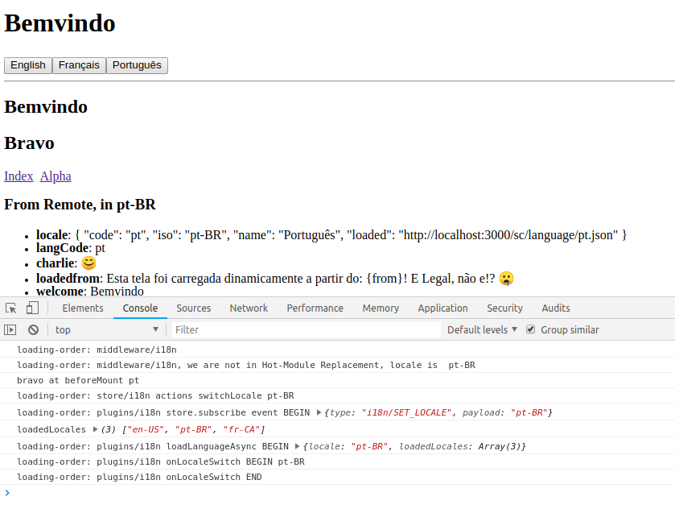

# Experimenting with Nuxt, with Vue i18n, and  Translations from remote

**Status**: objectives achieved.

Web Application that is not content centric such as an administrative dashboard,
or similar use-case typically also requires we have the UI in the users's language.

Assuming one store translation messages for a given locale elsewhere,
and we want Nuxt and Vue to import, and allow us to use messages.

This is a work spike, related to a contribution made on 2018-06,
while making a contribution to [**clarkdo/hare** (clarkdo/hare!339)](https://github.com/clarkdo/hare/pull/339)

## Objectives

Experiment and get better understanding of how things work for;

1. Learn and experiment with different supported i18n syntax is supported and how Nuxt supports them (e.g. `{{$('foo')}}`, `{{'foo'|translate}}`, `
`, etc.)
1. **Load ONLY needed translations**, according to session locale (not fully implemented here, it is assumed a user session would tell which locale to use)
1. Declaring base translation files, either as JSON, or JavaScript, or Module
1. Fetching data from remote endpoint, and merge with local Vue I18n instance, similarly to [*vue-i18n* "Dynamic Locale" feature](https://kazupon.github.io/vue-i18n/guide/migrations.html#dynamic-locale-removed)
1. Knowing which translation message keys are missing
1. Visualize (and eventually be able to work on) translation keys (not done here)

## Observations

At first, I thought that [nuxt-community/nuxt-i18n](https://nuxt-community.github.io/nuxt-i18n/basic-usage.html#nuxt-link) would be a good fit.

But turns out it is specialized for Nuxt projects that are content intensive and
heavily relies on the current path for a given view and was not fit for my objectives.

# Reference

* [vue-i18n](https://kazupon.github.io/vue-i18n/)
* (inspiration) [nuxt-i18n](https://nuxt-community.github.io/nuxt-i18n/basic-usage.html#nuxt-link)
* [nuxt-community/axios-module](https://axios.nuxtjs.org/options.html)
* [nuxt-community/proxy-module](https://github.com/nuxt-community/proxy-module#proxy)
